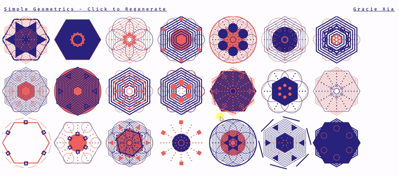

# geometricMotif

View Final Outcome here: https://codepen.io/graciexia8/project/full/ZeWOOb

Small Project creating gemometric motifs using p5.js functionalities. Each motif has randomly generated shapes rotated and translated accross x and y axis to create tesselation. Project time: 15 hours. 

Made using resources taught by Matthew Epler.

Resources:

https://github.com/zenozeng/p5.js-svg

https://github.com/matthewepler/Generative-Design-Systems-with-P5js

https://p5js.org/

TO View Project, download repository and open index.html
